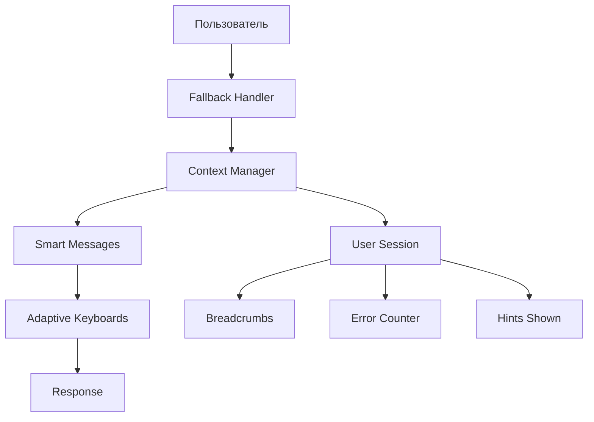

# 🚀 Комплексная система обработки всех состояний пользователя

## 📋 Обзор системы

Реализована полная система умного UX для Telegram-бота с мгновенным ответом в любом сценарии взаимодействия.

## 🧠 Ключевые компоненты

### 1. 🎯 Центральный менеджер контекста (`bot/context_manager.py`)

**Возможности:**
- Отслеживание состояний пользователя в реальном времени
- Автоматическое обнаружение запутанности пользователя
- История навигации (breadcrumbs)
- Система умных подсказок
- Профилирование предпочтений пользователя

**Типы контекстов:**
- `REGISTRATION` - процесс регистрации
- `SUPPORT` - работа с поддержкой  
- `NAVIGATION` - навигация по меню
- `INFO_BROWSING` - изучение информации
- `IDLE` - ожидание действий
- `CONFUSED` - пользователь запутался

### 2. 🛡️ Универсальная система Fallback (`bot/handlers/fallback.py`)

**Обработка неожиданных действий:**
- ✅ Стикеры вместо текста
- ✅ Голосовые сообщения  
- ✅ Фото в неподходящих местах
- ✅ Контакты не в том состоянии
- ✅ Любые медиафайлы
- ✅ Неизвестные callback-запросы

**Остроумные ответы:**
```
😄 Стикер отличный! Но мои нейросети пока читают только текст 🤖
🎙️ У вас приятный голос! Но я лучше читаю, чем слушаю
🤔 Небольшая навигационная заминка? Сейчас исправим!
```

### 3. 💬 Система умных сообщений (`bot/messages.py`)

**Профессиональные сообщения с подсказками:**

#### Регистрация:
- **Прогресс-индикаторы:** `🎯 Шаг 2 из 4: 🟢🟢⚪⚪`
- **Контекстные советы:** "💡 Подготовьте карту лояльности - понадобится на 3-м шаге"
- **Персонализация:** "✅ Отлично, Иван! Переходим к следующему шагу..."

#### Ошибки:
- **Умные подсказки:** "📱 Это похоже на номер телефона! Сейчас нам нужно ваше полное имя"
- **Примеры решений:** "✅ Попробуйте так: Петров Петр Петрович"

### 4. ⌨️ Адаптивные клавиатуры (`bot/smart_keyboards.py`)

**Динамические интерфейсы:**
- **Прогресс-бары** в placeholder'ах
- **Контекстные подсказки** для каждого шага
- **Адаптация под статус** пользователя
- **Популярность категорий:** "🔥 Проблема с фото (частая)"

**Примеры:**
```
📊 Шаг 2/4: 🟢🟢⚪⚪
💡 Подсказка: "Нажмите 'Отправить контакт' - быстрее и точнее!"
```

## 🎨 Визуальные ориентиры

### Эмодзи-система:
- 🎯 **Целевые действия** - основные кнопки
- ⚡ **Быстрые действия** - ускоренные опции  
- 🧭 **Навигация** - переходы между разделами
- 📊 **Прогресс** - индикаторы выполнения
- 💡 **Подсказки** - полезные советы
- 🔥 **Популярные** - часто используемые опции

### Цветовая схема:
- 🟢 **Завершенные шаги**
- ⚪ **Предстоящие шаги** 
- 🔵 **Текущий процесс**
- ❌ **Ошибки/проблемы**
- ✅ **Успех/подтверждение**

## 🚀 Умная навигация

### Предугадывание следующих шагов:

1. **Новый пользователь:**
   ```
   🎯 Начните с 🚀 Начать регистрацию для участия в розыгрыше
   🔮 Что дальше: После имени мы попросим ваш номер телефона 📱
   ```

2. **Застрял на регистрации:**
   ```
   🤔 Кажется, вы застряли на вводе имени!
   ✨ Подсказка: введите ваше полное имя как в паспорте
   🔮 Что дальше: После имени понадобится номер телефона 📱
   ```

3. **Запутался в навигации:**
   ```
   🧭 Похоже, мы свернули не туда. Давайте я покажу правильную дорогу!
   [Быстрая навигация с inline-кнопками]
   ```

## 🛠️ Обработка критических сценариев

### 1. Запутанный пользователь
- **Обнаружение:** 2+ ошибки подряд + неподходящий контент
- **Реакция:** Остроумный ответ + быстрая навигация
- **Решение:** Inline-кнопки с основными направлениями

### 2. Неожиданный контент  
- **Стикер вместо текста:** "😊 Принято с благодарностью! Но давайте старомодно - текстом"
- **Голос:** "🎵 Почти как подкаст! Но давайте письменно?"
- **Фото не в том месте:** "📸 Красивое фото! Но сейчас оно не подходит для текущего шага"

### 3. Технические проблемы
- **Неизвестная команда:** Автоматический редирект + объяснение
- **Устаревшие кнопки:** "🤖 Эта кнопка больше не активна. Вернемся в главное меню"
- **Таймауты:** Восстановление контекста с подсказками

## 📈 Пользовательский опыт

### ✅ Достигнутые цели:

1. **Мгновенный ответ** - бот отвечает на любое действие
2. **Умные подсказки** - контекстная помощь на каждом шаге
3. **Визуальные ориентиры** - четкое понимание прогресса
4. **Предугадывание** - система подсказывает следующие шаги
5. **Остроумие** - дружелюбные ответы сохраняют вовлеченность
6. **Профессионализм** - корпоративный стиль лучших брендов

### 🎯 Ключевые принципы:

- **Никаких тупиков** - всегда есть выход из ситуации
- **Контекстная помощь** - подсказки зависят от текущего состояния  
- **Прогрессивное раскрытие** - информация дается порциями
- **Эмоциональная связь** - остроумие + профессионализм
- **Адаптивность** - интерфейс подстраивается под пользователя

## 🔧 Техническая архитектура



### Приоритет обработчиков:
1. **Специфические обработчики** (высокий приоритет)
2. **Fallback обработчики** (низкий приоритет) 
3. **Универсальная обработка** (самый низкий)

### Кэширование:
- Статус пользователя (hot cache)
- Сессии пользователей (memory)
- Показанные подсказки (session)

## 🎉 Результат

Создана **комплексная система**, которая:

✅ **Обрабатывает любые действия** пользователя  
✅ **Мгновенно отвечает** в любом сценарии  
✅ **Предугадывает потребности** и направляет к цели  
✅ **Говорит остроумно** но профессионально  
✅ **Адаптируется** под каждого пользователя  
✅ **Исключает тупиковые** ситуации  

Система превращает любое взаимодействие в **плавный, интуитивный опыт** мирового уровня! 🚀
